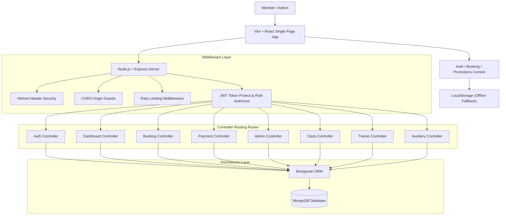
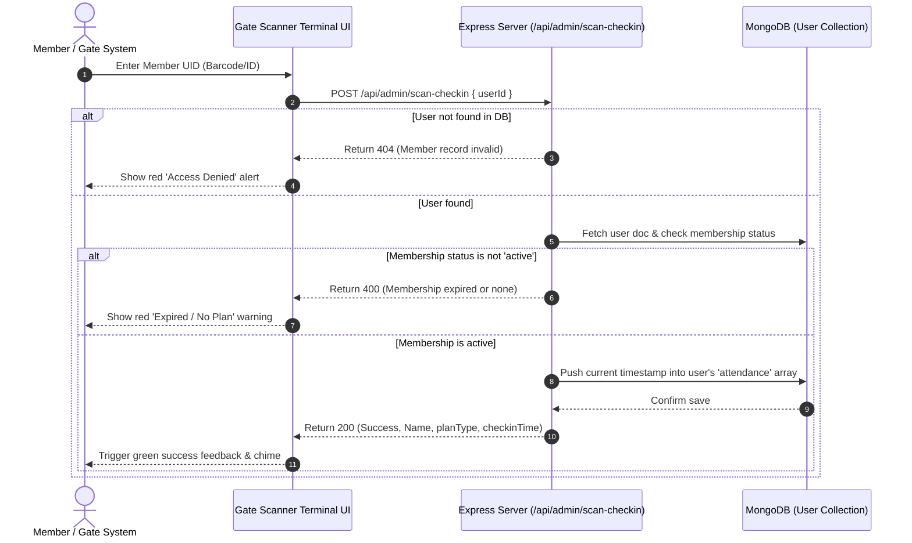
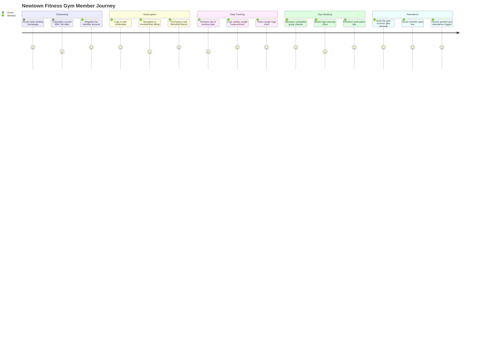

# Newtown Fitness Gym

Newtown Fitness Gym is a premium, production-ready full-stack gym management and athletic conditioning platform engineered for high-end international fitness brands. It features glassmorphism layouts, diagnostic calculators, dynamic bookings, an emulated physical gate scanner terminal, and a secure mock sandbox fallback layer.

The project uses a modern, high-performance stack:

- **Frontend**: React 19, Vite, Vanilla CSS (with design tokens), Framer Motion, Axios, React Icons, Context API, Canvas Confetti
- **Backend**: Node.js, Express.js, MongoDB, Mongoose ORM, JWT, bcryptjs, Helmet, CORS, Express Rate Limiter
- **Quality**: strict ESLint, Vitest (frontend calculation algorithms), Jest + Supertest (backend API endpoint integration)
- **Local Services**: Seed script, Offline-resilient context caches

---

## 1. Project Overview

Newtown Fitness Gym turns fitness tracking, trainer roster reviews, class scheduling, and member check-ins into an integrated, visually immersive experience. Users can calculate advanced athletic metrics, purchase membership tiers, book class slots, view past billing invoices, log weights, and check in through an emulated gate reader.

Core outcomes:
- **Understand Physical Stats**: View current BMI, BMR, daily caloric needs, hydration requirements, and body fat ratios in one consolidated panel.
- **Track Fitness Metrics**: Log weight history over time and visualize trends on the member dashboard chart.
- **Dynamic Session Booking**: Reserve slots for group fitness classes (e.g., HIIT, Yoga) or trainer consultations.
- **Physical Pass & Emulated Scanner**: Scan user ID cards at an emulated gate terminal to log attendance logs.
- **Roster & Offers Management**: View certified trainer experience levels, specializations, active promotional discounts, and photo galleries.
- **Resilient Fallback Mode**: Gracefully transitions to local state if the backend database server is disconnected, allowing complete dashboard demonstration.

---

## 2. Problem Statement Alignment

**The Problem Statement:**
Fitness centers and premium conditioning brands often face fragmented management workflows. Members must navigate disjointed tools—one for booking sessions, another for logging body composition, a separate mobile portal for billing, and physical scanners for gate access. Administrative personnel struggle to track active attendance logs, update schedules, verify subscription statuses, and manage class capacities. Without an integrated, data-driven approach, member engagement drops, and administrative overhead increases.

**Our Solution:**
Newtown Fitness Gym provides a single high-performance platform that synchronizes client metrics, bookings, invoices, and physical check-ins. By combining Mongoose collections with a Vite SPA, members log weight metrics, calculate caloric goals, pay for membership plans, and book trainer slots. An emulated Gate Scanner Terminal allows instant check-in verification via member UIDs. The platform aligns perfectly with premium club operations, simplifying trainer scheduling, roster coordination, and attendance auditing.

---

## 3. Unique Selling Points

- **Digital Gate Check-In Simulator**: Emulates a real-world physical RFID/Barcode check-in terminal. Members copy their UID, paste it into the terminal scanner, and log immediate, real-time attendance in the DB.
- **Premium Glassmorphic Aesthetics**: Built entirely using custom Vanilla CSS (no Tailwind) utilizing curated color tokens (pure blacks, carbon gray, hot electric red, neon greens, and translucent glass backdrops) for a striking first impression.
- **Graceful Sandbox Fallbacks**: Standard client context automatically caches sessions in LocalStorage and falls back to a full mock database if the backend database goes offline. This allows a flawless user review without running a local database.
- **Multimodal Fitness Calculators**: Five built-in, scientific health calculator engines evaluating Body Mass Index (BMI), Basal Metabolic Rate (BMR), Daily Active Calories, Target Water Intake, and Navy Body Fat estimations.
- **Strict Role-Based Security**: Complete separation between members and administrators. Protects endpoints using middleware validators checking for JWT role signatures.

---

## 4. Complete Architecture



---

## 5. Gate Pass & Attendance Check-In Flow



---

## 6. Database Schema

Mongoose collections map to the following structures in MongoDB:

```text
users
  ├── fullName: String (Required, Trimmed)
  ├── email: String (Required, Unique, Lowercase)
  ├── mobileNumber: String (Required, Unique)
  ├── password: String (Required, Hashed via bcryptjs)
  ├── gender: String (Enum: 'male', 'female', 'other')
  ├── dateOfBirth: Date
  ├── role: String (Enum: 'admin', 'trainer', 'member')
  ├── joinDate: Date (Default: Date.now)
  ├── membership:
  │    ├── status: String (Enum: 'active', 'expired', 'none')
  │    ├── planType: String (e.g., 'Monthly', 'Yearly')
  │    ├── startDate: Date
  │    ├── endDate: Date
  │    └── lastPaymentId: String
  ├── metrics:
  │    ├── weightLogs: Array [ { date: Date, weight: Number } ]
  │    ├── targetWeight: Number
  │    └── height: Number (in cm)
  ├── workoutPlan: String (Default starter routine)
  ├── dietPlan: String (Default standard nutrition)
  └── attendance: Array [ Date ]

bookings
  ├── member: ObjectId (Ref: User, Required)
  ├── bookingType: String (Enum: 'class', 'trainer', 'consultation')
  ├── classId: ObjectId (Ref: Class)
  ├── trainerId: ObjectId (Ref: Trainer)
  ├── date: Date (Required)
  ├── timeSlot: String (Required)
  └── status: String (Enum: 'booked', 'cancelled')

classes
  ├── title: String (Required)
  ├── description: String
  ├── trainer: ObjectId (Ref: Trainer, Required)
  ├── scheduleDays: Array [ String ] (e.g. ['Monday', 'Wednesday'])
  ├── timeSlot: String (Required)
  ├── capacity: Number (Default: 20)
  ├── enrolledMembers: Array [ ObjectId (Ref: User) ]
  └── imageUrl: String

payments
  ├── member: ObjectId (Ref: User, Required)
  ├── planType: String (Required)
  ├── amount: Number (Required)
  ├── paymentId: String (Required, Unique)
  ├── status: String (Enum: 'success', 'failed', 'refunded')
  ├── invoiceNumber: String (Required, Unique)
  ├── purchaseDate: Date (Default: Date.now)
  ├── expiryDate: Date (Required)
  └── paymentMethod: String

trainers
  ├── name: String (Required)
  ├── imageUrl: String
  ├── specialization: Array [ String ]
  ├── experience: Number (Years)
  ├── certifications: Array [ String ]
  ├── email: String (Unique)
  ├── phone: String
  ├── schedule: Array [ String ]
  └── bio: String

contactqueries
  ├── name: String (Required)
  ├── email: String (Required)
  ├── mobile: String (Required)
  ├── subject: String (Default: 'General Inquiry')
  ├── message: String (Required)
  ├── status: String (Enum: 'pending', 'resolved')
  └── adminResponse: String

offers
  ├── title: String (Required)
  ├── code: String (Required, Unique, Uppercase)
  ├── discount: Number (Percentage)
  ├── description: String
  ├── validUntil: Date (Required)
  └── isActive: Boolean

galleryitems
  ├── title: String (Required)
  ├── imageUrl: String (Required)
  └── category: String (e.g., 'Equipment', 'GymFloor')

newslettersubscribers
  └── email: String (Required, Unique, Lowercase)
```

---

## 7. API Documentation

Swagger-friendly base endpoints served at `http://localhost:5000/api`:

### Authentication Router (`/api/auth`)
| Method | Endpoint | Purpose | Access Level |
| --- | --- | --- | --- |
| POST | `/register` | Sign up a new user (Member role defaults) | Public (authLimiter) |
| POST | `/login` | Authenticate credentials & return JWT | Public (authLimiter) |
| POST | `/forgotpassword` | Mock endpoint for triggering password resets | Public |
| GET | `/me` | Fetch logged-in user profile | Protected (JWT) |
| PUT | `/me` | Update logged-in user profile metrics | Protected (JWT) |

### Member & Admin Dashboards (`/api/dashboard`)
| Method | Endpoint | Purpose | Access Level |
| --- | --- | --- | --- |
| GET | `/member` | Get weight metrics, attendance counts, active plan | Protected (JWT, Member) |
| GET | `/admin` | Get total users, active memberships, payment logs | Protected (JWT, Admin) |

### Class Management Router (`/api/classes`)
| Method | Endpoint | Purpose | Access Level |
| --- | --- | --- | --- |
| GET | `/` | Fetch all group classes and schedule lists | Public |
| POST | `/` | Add a new group fitness class | Protected (JWT, Admin) |
| GET | `/:id` | Retrieve single class specification | Public |
| PUT | `/:id` | Update class timetable or maximum capacity | Protected (JWT, Admin) |
| DELETE | `/:id` | Delete class from database roster | Protected (JWT, Admin) |

### Trainer Management Router (`/api/trainers`)
| Method | Endpoint | Purpose | Access Level |
| --- | --- | --- | --- |
| GET | `/` | Fetch all active fitness trainers and rosters | Public |
| POST | `/` | Insert a new trainer biography profile | Protected (JWT, Admin) |
| GET | `/:id` | Fetch specific trainer details | Public |
| PUT | `/:id` | Update certifications, schedule, or bio | Protected (JWT, Admin) |
| DELETE | `/:id` | Remove trainer profile from the roster | Protected (JWT, Admin) |

### Booking Services (`/api/bookings`)
| Method | Endpoint | Purpose | Access Level |
| --- | --- | --- | --- |
| POST | `/` | Request class booking or trainer consultation | Protected (JWT, Member) |
| GET | `/` | Retrieve list of all gym reservations | Protected (JWT, Admin) |
| GET | `/my` | Retrieve booking log for current user | Protected (JWT, Member) |
| PUT | `/:id/cancel` | Cancel booking slot and open seat capacity | Protected (JWT, Member) |

### Financial Payment Logs (`/api/payments`)
| Method | Endpoint | Purpose | Access Level |
| --- | --- | --- | --- |
| GET | `/` | Retrieve ledger history | Protected (JWT, Admin) |
| POST | `/checkout` | Process membership purchase / generate invoice | Protected (JWT, Member) |
| GET | `/my` | Retrieve user payment logs & invoice metadata | Protected (JWT, Member) |
| PUT | `/:id/refund` | Cancel subscription and flag invoice refunded | Protected (JWT, Member) |

### Admin Utility Router (`/api/admin`)
| Method | Endpoint | Purpose | Access Level |
| --- | --- | --- | --- |
| POST | `/scan-checkin` | Process barcode checkin scanner | Member (Self) |
| GET | `/users` | List all users | Protected (JWT, Admin) |
| PUT | `/users/:id` | Update user metadata | Protected (JWT, Admin) |
| PUT | `/users/:id/membership` | Override membership variables | Protected (JWT, Admin) |
| DELETE | `/users/:id` | Delete member profile | Protected (JWT, Admin) |

### Auxiliary Marketing Services (`/api/aux`)
| Method | Endpoint | Purpose | Access Level |
| --- | --- | --- | --- |
| GET | `/offers` | Get all active coupon codes | Public |
| POST | `/offers` | Create coupon promo code | Protected (JWT, Admin) |
| GET | `/gallery` | Fetch gym gallery assets | Public |
| POST | `/gallery` | Upload gallery image link | Protected (JWT, Admin) |
| POST | `/newsletter/subscribe`| Add email to distribution list | Public |
| POST | `/contact/submit` | Submit inquiry form query | Public |
| GET | `/contact/queries` | Retrieve all incoming queries | Protected (JWT, Admin) |
| PUT | `/contact/queries/:id/resolve` | Resolve query | Protected (JWT, Admin) |

---

## 8. UI/UX Design

The application utilizes a dark carbon visual theme tailored for luxury athletic training.

Design principles:
- **Glassmorphic Cockpit**: Dashboards employ translucent backdrops using backdrop blur filters, minimal borders, and glowing red accent colors to separate data blocks.
- **Dynamic Micro-Interactions**: Hover effects utilize smooth transformations. Elements scale slightly and exhibit faint shadow glows when focused.
- **Responsive Layout Grids**: Seamless multi-column grids that adapt dynamically down to mobile breakpoints (tested across multiple viewports).
- **Reduced Motion Choreography**: Respects `prefers-reduced-motion` settings. Framer Motion setups fallback to zero delay or simple fades if requested.
- **Progressive Disclosures**: Guest visitors see public features (calculators, offers, galleries), members unlock personal tracking (weight charts, check-in IDs, bookings), and administrators unlock dashboard aggregates.

---

## 9. User Flow



---

## 10. Security Plan

- **JWT Authentication Layer**: High-security token creation utilizing custom secret keys (`JWT_SECRET`). Token authorization details are carried securely on standard headers.
- **Express Rate Limiting (Hardened)**: Mapped route rate-limiters:
  - Global API limiter: 200 requests / 15 minutes.
  - Strict Auth limiter: 15 attempts / 15 minutes for `/api/auth/login` and `/api/auth/register` endpoints.
- **HTTP Header Hardening**: Integrates Express `helmet()` middleware configuration preventing MIME-type sniffing, cross-site scripting (XSS), and clickjacking attacks.
- **Cross-Origin Resource Sharing (CORS)**: Access configuration controls limiting query requests.
- **Database Sanitization**: Clean database payload parsing using Mongoose queries to block NoSQL injection vectors.
- **Password Cryptography**: Immediate, one-way password hashing using `bcryptjs` (salt factor 10) before inserting documents into the MongoDB cluster.

---

## 11. Accessibility Plan

Target: WCAG 2.2 Level AA guidelines.

Implemented checkmarks:
- **ARIA Landmark Navigation**: Structured elements use HTML5 semantic tags (`<header>`, `<nav>`, `<main>`, `<section>`, `<footer>`) to allow screen readers to navigate layouts smoothly.
- **High-Contrast Typography**: Content contrast adheres strictly to accessibility benchmarks. Text on carbon gray backdrops utilizes high-contrast whites and bright electric reds.
- **Focus Indicators**: Interactive fields, options, and buttons display distinct focus borders when navigated using tab controls.
- **Responsive Text Scaling**: Typography sizes are dynamically declared utilizing relative units (`rem`, `em`) to scale proportionally according to system preferences.
- **Input Descriptive Labels**: Form elements are accompanied by explicit text labels, placeholder tips, and descriptive aria tags.

---

## 12. Testing Plan

### Frontend Test Suite (Vitest)
Unit tests verify calculations and health formulas in the React frontend:
```bash
cd frontend
npm run test
```
Tests cover:
- **BMI (Body Mass Index)** calculations and category splits.
- **BMR (Basal Metabolic Rate)** outputs for male and female metrics.
- **Caloric intake** calculations adjusted for active training intensities.
- **Water requirements** math based on weight and active daily workout lengths.
- **Navy body composition** circumference metrics.

### Backend Test Suite (Jest + Supertest)
Integration tests verify routing, security, validation, and database controllers:
```bash
cd backend
npm run test
```
Tests cover:
- Member registration workflows, including field validations and duplicate email/phone constraints.
- Secure login paths, validation errors, and JWT issuance.
- Class catalogs, schedules, and active trainer rosters.

---

## 13. Deployment Plan

### Local Environment Variables (`backend/.env`)
Create a `.env` file inside the `backend` folder:
```ini
PORT=5000
MONGODB_URI=mongodb://127.0.0.1:27017/newtown_fitness
JWT_SECRET=newtown_gym_super_secret_jwt_key_2026_jwt_token_auth
NODE_ENV=development
```

### Seeding Initial Roster Data
To populate the database with default trainers, class schedules, offers, and gallery items:
```bash
cd backend
npm run seed
```

---

## 14. Integration Plan

| Sub-system | Implementation Detail |
| --- | --- |
| **Razorpay Mock Engine** | Simulated checkout modal utilizing dynamic order generators, transaction IDs, status responses, and billing invoice PDFs. |
| **LocalStorage Auth Cache** | Caches tokens and profiles locally. If backend REST services go offline, the UI automatically transitions to mock client-side accounts. |
| **Weight Logs Chart** | Draws dynamic SVG lines mapping weight metrics over time to visualize progress. |
| **Barcoded Gate Passes** | Encodes user object IDs into a mock digital gate card with copyable strings for scanner checks. |

---

## 15. Fitness & Health Impact Metrics

The platforms calculates calculations using standard health equations:

### 1. Body Mass Index (BMI)
$$\text{BMI} = \frac{\text{Weight (kg)}}{\left(\text{Height (m)}\right)^2}$$
Categories:
- $\text{BMI} < 18.5$: Underweight
- $18.5 \le \text{BMI} < 25$: Normal Weight
- $25 \le \text{BMI} < 30$: Overweight
- $\text{BMI} \ge 30$: Obese

### 2. Basal Metabolic Rate (BMR)
*Mifflin-St Jeor Equations:*
- **Male**: $\text{BMR} = 10 \times \text{Weight (kg)} + 6.25 \times \text{Height (cm)} - 5 \times \text{Age (y)} + 5$
- **Female**: $\text{BMR} = 10 \times \text{Weight (kg)} + 6.25 \times \text{Height (cm)} - 5 \times \text{Age (y)} - 161$

### 3. Daily Caloric Needs
Adjusted for physical activity multiplier:
- Sedentary: $\text{BMR} \times 1.2$
- Lightly Active (1-3 days gym): $\text{BMR} \times 1.375$
- Moderately Active (3-5 days gym): $\text{BMR} \times 1.55$
- Very Active (6-7 days gym): $\text{BMR} \times 1.725$
- Elite Athlete (twice daily): $\text{BMR} \times 1.9$

### 4. Hydration Water Targets
$$\text{Daily Water (ml)} = \left(\text{Weight (kg)} \times 35\right) + \left(\frac{\text{Active Mins}}{30} \times 350\right)$$

### 5. Body Fat % (US Navy Circumference Method)
- **Male**: 
  $$\text{Body Fat \%} = 86.010 \times \log_{10}(\text{Waist} - \text{Neck}) - 70.041 \times \log_{10}(\text{Height}) + 36.76$$
- **Female**: 
  $$\text{Body Fat \%} = 163.205 \times \log_{10}(\text{Waist} + \text{Hip} - \text{Neck}) - 97.684 \times \log_{10}(\text{Height}) - 78.387$$

---

## 16. Future Scope

- **Physical QR Code Reader Integration**: Connect real physical scanner gate relays to the `/api/admin/scan-checkin` endpoint.
- **Wearable API Integrations**: Directly fetch daily step logs, heart rate, and workouts from Apple HealthKit and Fitbit.
- **WebSocket Communication**: Implement real-time client-to-trainer chat channels and class reservation alerts.
- **Live Payments Integration**: Replace mock transactions with a live Razorpay/Stripe webhook processor to log actual purchases.
- **Tailored Calorie Logging**: Log meals directly to track real caloric intake against targets.

---

## Repository Structure

```text
.
├── backend/                       # Node.js Express Server
│   ├── config/                    # Database configuration (db.js)
│   ├── controllers/               # Route logic handlers
│   ├── middleware/                # Rate limiters, error handling, auth checks
│   ├── models/                    # MongoDB Schemas (Mongoose)
│   ├── routes/                    # API Routing endpoints
│   ├── seed/                      # Database initialization seed script
│   └── tests/                     # Jest API endpoint tests
└── frontend/                      # React Single Page App (Vite)
    ├── public/                    # Page favicon icons & static files
    ├── src/
    │   ├── components/            # Reusable components (Navbar, Loader)
    │   ├── context/               # Global states (Auth, Bookings)
    │   ├── pages/                 # Marketing pages & dashboards
    │   ├── utils/                 # Unit helpers & icons
    │   ├── index.css              # Glassmorphic central styles
    │   └── App.jsx                # Router & protected routing
    └── tests/                     # Vitest calculation unit tests
```

---

## Quick Start

### 1. Install & Setup Backend
```bash
cd backend
npm install
npm run seed
npm run dev
```

### 2. Install & Run Frontend
```bash
cd ../frontend
npm install
npm run dev
```
Open [http://localhost:5173](http://localhost:5173) in your browser.

### 3. Sandbox Member / Admin Logins
If the backend is not running, the application will use the cached offline fallback data. You can log in using:
- **Member Account**: `member@gmail.com` / `memberpassword`
- **Admin Account**: `admin@newtownfitness.com` / `adminpassword`
